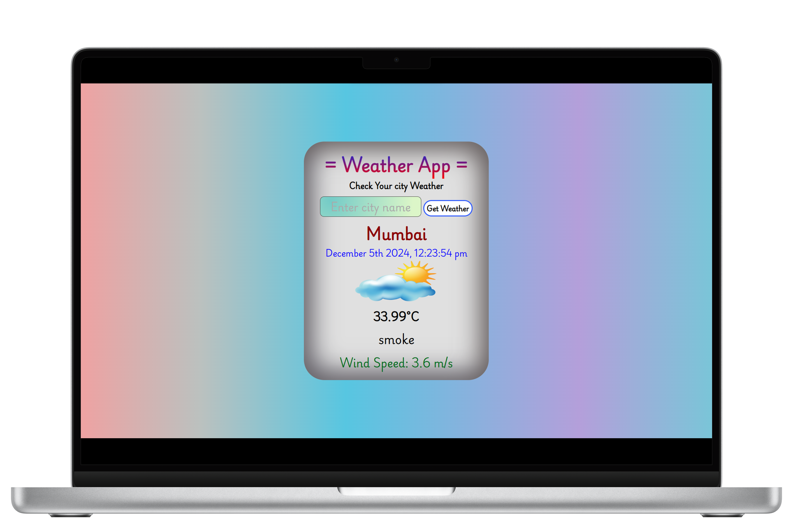

# Weather Info

A weather info app that displays the current weather conditions for a given city.

## Features

- Displays the current weather conditions for a given city.
- Displays the current date and time.
- Displays the current temperature.
- Displays the current description.
- Displays the current wind speed.
- Displays the current weather icon.

## User Interface

## Technologies Used

- HTML
- CSS
- JavaScript
- API
- Vite
- jQuery
- Moment.js

## Setup

Clone Repo

`git clone https://github.com/Ayushparikh-code/Web-dev-mini-projects.git`

Go to the directory

`cd Web-dev-mini-projects/workspaces/weatherInfo`

Install dependencies

`pnpm install`

Run the project

`pnpm run dev`

# license

